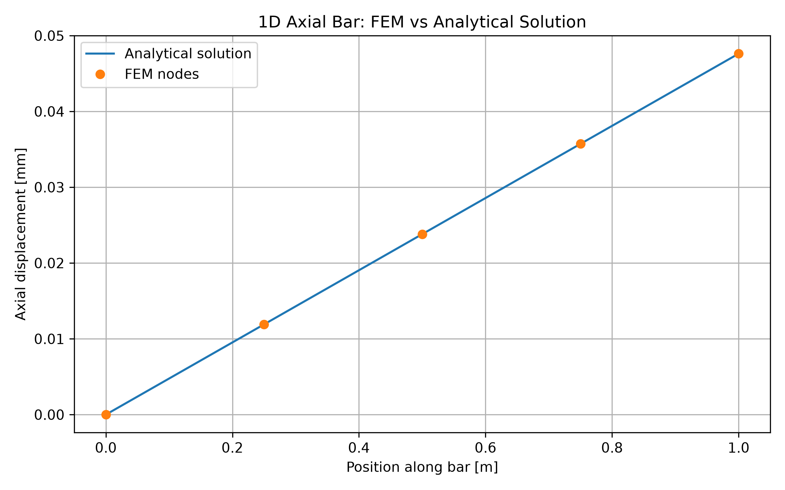
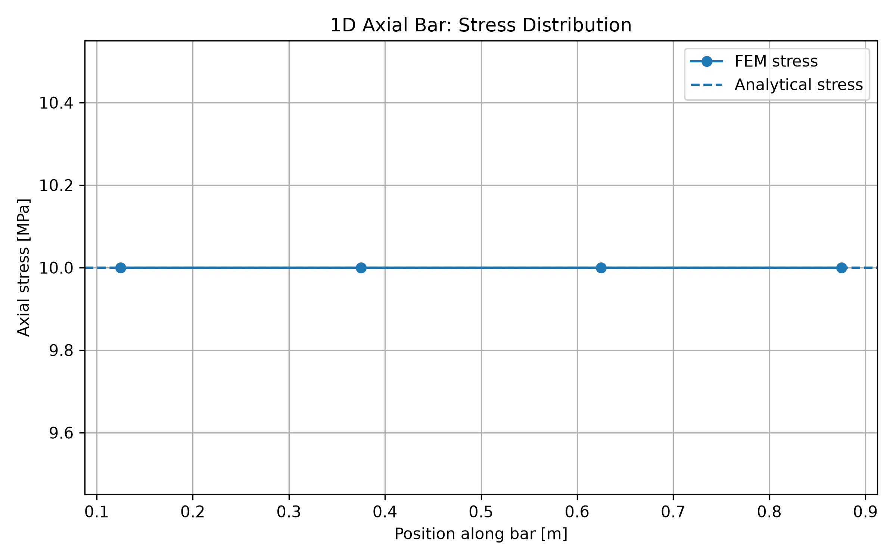
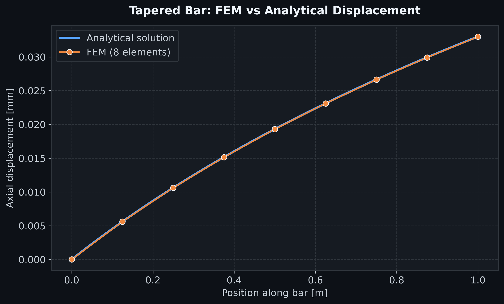
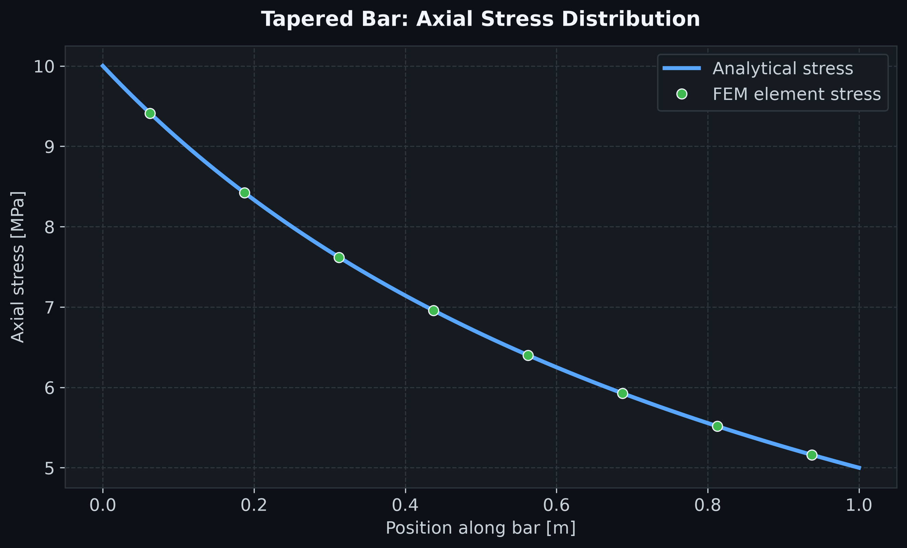
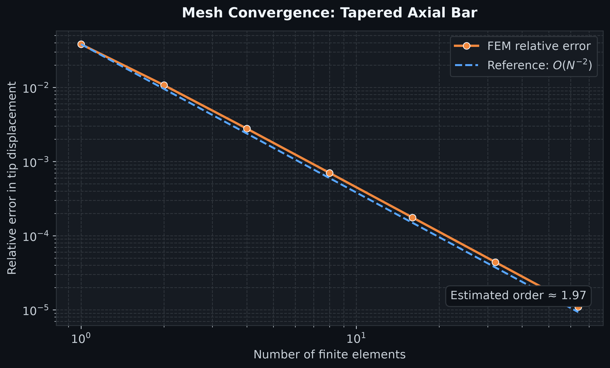

# FEM from Scratch

[](https://github.com/Vaib2001/fem-from-scratch/actions/workflows/fem-analysis.yml)

Finite Element Method implementations developed from first principles in Python and verified against analytical solutions.

The project focuses on the numerical mechanics behind FEM: element formulation, global assembly, boundary conditions, solution procedures, stress recovery, analytical verification, mesh convergence, automated numerical testing, and reproducible engineering workflows.

---

## Overview

This repository currently contains two one-dimensional structural mechanics problems:

1. **Uniform axial bar**
2. **Tapered axial bar**

The uniform bar introduces the basic finite-element formulation and provides an exact analytical benchmark.

The tapered bar introduces a spatially varying cross-section and therefore a nonlinear exact displacement field. This produces genuine finite-element discretization error and allows mesh convergence to be studied quantitatively.

### Current capabilities

- 2-node linear axial bar elements
- element stiffness formulation
- global stiffness-matrix assembly
- essential boundary conditions
- external nodal loading
- nodal displacement solution
- strain recovery
- stress recovery
- analytical verification
- variable cross-sectional area
- mesh-refinement studies
- convergence-order estimation
- engineering visualization
- automated numerical tests
- continuous integration with GitHub Actions

---

# 1. Uniform Axial Bar

Consider a prismatic elastic bar with length $L$, cross-sectional area $A$, and Young's modulus $E$.

The left end is fixed and an axial load $P$ is applied at the right end.

```text
x = 0                                      x = L
│                                             →
│============================================= P
│
Fixed
```

The governing differential equation is

```math
-\frac{d}{dx}
\left(
EA\frac{du}{dx}
\right)
=0
```

with the displacement boundary condition

```math
u(0)=0
```

and the traction boundary condition

```math
EA\frac{du}{dx}\bigg|_{x=L}=P
```

---

## Finite-Element Formulation

For a two-node linear bar element, the element displacement vector is

```math
\mathbf{u}^{(e)}
=
\begin{bmatrix}
u_1 \\
u_2
\end{bmatrix}
```

Using linear shape functions, the element stiffness matrix becomes

```math
\mathbf{k}^{(e)}
=
\frac{EA}{L_e}
\begin{bmatrix}
1 & -1 \\
-1 & 1
\end{bmatrix}
```

where $L_e$ is the element length.

The individual element matrices are assembled into the global equilibrium system

```math
\mathbf{K}\mathbf{u}
=
\mathbf{F}
```

After imposing the fixed displacement boundary condition, the reduced linear system is solved using `numpy.linalg.solve`.

---

## Analytical Solution

For a uniform axial bar subjected to a constant end load,

```math
u(x)
=
\frac{Px}{EA}
```

The axial strain is

```math
\varepsilon
=
\frac{du}{dx}
=
\frac{P}{EA}
```

and therefore the axial stress is

```math
\sigma
=
E\varepsilon
=
\frac{P}{A}
```

### Reference problem

| Parameter | Value |
|---|---:|
| Length $L$ | 1.0 m |
| Cross-sectional area $A$ | 0.01 m² |
| Young's modulus $E$ | 210 GPa |
| Applied load $P$ | 100 kN |
| Number of finite elements | 4 |

The analytical tip displacement is

```math
u(L)
=
4.7619\times10^{-5}\ \text{m}
```

or

```math
u(L)
\approx
0.047619\ \text{mm}
```

The corresponding axial stress is

```math
\sigma
=
10\ \text{MPa}
```

---

## Displacement Verification



The FEM nodal solution coincides with the analytical displacement field.

This is expected because the exact solution is linear in $x$, while the two-node axial element also uses linear displacement interpolation.

Therefore, the exact solution lies inside the finite-element approximation space for this particular problem.

---

## Stress Verification



The finite-element stress remains constant along the bar and agrees with the analytical result

```math
\sigma
=
10\ \text{MPa}
```

---

# 2. Tapered Axial Bar

The second problem introduces a cross-sectional area that varies continuously along the bar.

The area is defined as

```math
A(x)
=
A_0
\left(
1+\alpha\frac{x}{L}
\right)
```

where $A_0$ is the area at the fixed end and $\alpha$ controls the taper.

For the implemented example,

```math
\alpha = 1
```

which gives

```math
A(L)
=
2A_0
```

The bar therefore becomes progressively wider toward the loaded end.

Unlike the uniform-bar problem, the exact displacement field is now nonlinear.

---

## Governing Relation

For a constant axial force $P$,

```math
N(x)
=
EA(x)\frac{du}{dx}
=
P
```

Therefore,

```math
\frac{du}{dx}
=
\frac{P}{EA(x)}
```

Substituting the linearly varying area,

```math
\frac{du}{dx}
=
\frac{P}
{
EA_0
\left(
1+\alpha x/L
\right)
}
```

---

## Analytical Displacement

Integrating from the fixed boundary gives

```math
u(x)
=
\int_0^x
\frac{P}
{
EA_0
\left(
1+\alpha \xi/L
\right)
}
\,d\xi
```

which results in

```math
u(x)
=
\frac{PL}
{
EA_0\alpha
}
\ln
\left(
1+\alpha\frac{x}{L}
\right)
```

The exact tip displacement is therefore

```math
u(L)
=
\frac{PL}
{
EA_0\alpha
}
\ln(1+\alpha)
```

For $\alpha=1$,

```math
u(L)
=
\frac{PL}
{
EA_0
}
\ln(2)
```

---

## Analytical Stress

Since the internal axial force remains equal to $P$,

```math
\sigma(x)
=
\frac{P}{A(x)}
```

Substituting the tapered area,

```math
\sigma(x)
=
\frac{P}
{
A_0
\left(
1+\alpha x/L
\right)
}
```

As the cross-sectional area increases, the axial stress decreases along the bar.

---

## Tapered-Bar FEM Formulation

The same two-node linear axial element is used.

For each element,

```math
\mathbf{k}^{(e)}
=
\int_{x_1}^{x_2}
\mathbf{B}^{T}
EA(x)
\mathbf{B}
\,dx
```

For a two-node linear bar element, $\mathbf{B}$ is constant within the element.

Because $A(x)$ varies linearly, the element-integrated stiffness can be evaluated exactly using the element-average area

```math
A_{\mathrm{avg}}
=
\frac{A(x_1)+A(x_2)}{2}
```

which gives

```math
\mathbf{k}^{(e)}
=
\frac{
E A_{\mathrm{avg}}
}{
L_e
}
\begin{bmatrix}
1 & -1 \\
-1 & 1
\end{bmatrix}
```

---

## Tapered-Bar Displacement



The finite-element solution closely follows the analytical displacement field.

Unlike the uniform-bar case, the exact solution is logarithmic rather than linear. Therefore, a finite number of linear elements cannot reproduce it exactly.

This introduces genuine discretization error.

---

## Tapered-Bar Stress



The analytical stress decreases continuously along the bar according to

```math
\sigma(x)
=
\frac{P}{A(x)}
```

The finite-element solution produces piecewise-constant element stresses that approach the analytical stress distribution as the mesh is refined.

---

# Mesh Convergence Study

A central requirement of a reliable finite-element implementation is that the numerical solution approaches the exact solution as the mesh is refined.

The tapered bar is therefore solved using

```math
N
=
1,\ 2,\ 4,\ 8,\ 16,\ 32,\ 64
```

finite elements.

The relative error in tip displacement is calculated as

```math
e_{\mathrm{rel}}
=
\frac{
\left|
u_{\mathrm{FEM}}(L)
-
u_{\mathrm{exact}}(L)
\right|
}{
\left|
u_{\mathrm{exact}}(L)
\right|
}
```

---

## Convergence Result



The relative error decreases systematically as the mesh is refined.

The observed behaviour is approximately

```math
e
\propto
N^{-2}
```

or equivalently,

```math
e
=
O(N^{-2})
```

This corresponds to approximately second-order convergence for the evaluated tip-displacement quantity.

The convergence study demonstrates that the numerical solution approaches the analytical solution under systematic mesh refinement.

---

# Numerical Verification Tests

The repository includes automated tests using `pytest`.

The current test suite verifies:

- the fixed-end displacement is exactly zero,
- the uniform-bar FEM tip displacement matches the analytical solution,
- the uniform-bar stress matches $P/A$,
- tapered-bar error decreases under mesh refinement,
- a sufficiently refined tapered-bar mesh achieves the required numerical accuracy.

The tests can be run with

```bash
pytest -q
```

A successful test run verifies important numerical and physical properties of the implementation rather than only checking whether the Python scripts execute.

---

# Continuous Integration

GitHub Actions automatically executes the complete numerical-analysis workflow after changes are pushed to `main`.

```text
Push to main
     │
     ▼
Create clean Python environment
     │
     ▼
Install dependencies
     │
     ▼
Run uniform-bar FEM solver
     │
     ▼
Generate uniform-bar figures
     │
     ▼
Run tapered-bar FEM solver
     │
     ▼
Run mesh-convergence study
     │
     ▼
Run numerical verification tests
     │
     ▼
Update generated FEM results
```

This makes the project reproducible independently of the local development environment.

A green workflow status therefore indicates that the solver, post-processing pipeline, convergence analysis, and numerical verification tests have completed successfully.

---

# Project Structure

```text
fem-from-scratch/
│
├── .github/
│   └── workflows/
│       └── fem-analysis.yml
│
├── src/
│   ├── __init__.py
│   ├── bar_1d.py
│   ├── tapered_bar.py
│   ├── visualize_bar.py
│   └── convergence_study.py
│
├── tests/
│   └── test_fem.py
│
├── results/
│   ├── README.md
│   ├── displacement_comparison.png
│   ├── stress_distribution.png
│   ├── tapered_displacement.png
│   ├── tapered_stress.png
│   └── tapered_convergence.png
│
├── requirements.txt
├── pytest.ini
├── README.md
└── LICENSE
```

---

# Running the Project

Install the required Python packages:

```bash
pip install -r requirements.txt
```

Run the uniform-bar FEM analysis:

```bash
python src/bar_1d.py
```

Generate the uniform-bar figures:

```bash
python src/visualize_bar.py
```

Run the tapered-bar analysis:

```bash
python src/tapered_bar.py
```

Run the mesh-convergence study:

```bash
python src/convergence_study.py
```

Run the numerical verification tests:

```bash
pytest -q
```

Generated engineering figures are stored in the `results/` directory.

---

# Engineering Concepts Demonstrated

This repository demonstrates:

- finite-element discretization
- shape-function-based formulation
- element stiffness matrices
- global matrix assembly
- degree-of-freedom handling
- essential boundary conditions
- natural boundary conditions
- numerical solution of linear systems
- displacement recovery
- strain calculation
- stress recovery
- variable material geometry
- analytical verification
- discretization error
- systematic mesh refinement
- convergence-rate estimation
- scientific visualization
- automated numerical testing
- continuous integration
- reproducible computational workflows

---

# Future Development

The next stage will extend the formulation from one-dimensional axial mechanics toward multi-dimensional structural FEM.

Planned extensions include:

- spring elements
- 2D truss elements
- local-to-global coordinate transformations
- arbitrary truss geometries
- distributed loading
- 2D linear elasticity
- constant-strain triangular elements
- stress-field visualization
- comparison against established FEM software

---

## Technology

`Python` · `NumPy` · `Matplotlib` · `pytest` · `GitHub Actions`

---

## License

This project is released under the MIT License.
